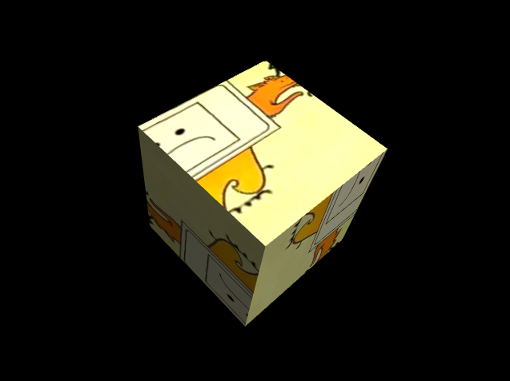

# Cartoon Cube - WebGL 3D Animation

## Project Overview

This project demonstrates a 3D animated cube model created using WebGL. The cube features stylized cartoon illustrations on each face, showcasing the integration of 2D artwork with 3D modeling and web-based rendering techniques.

## Features

- 3D cube model with unique cartoon textures on each face
- WebGL-based rendering for high-performance graphics in web browsers
- Smooth animation and rotation of the 3D object
- Custom shader implementation for enhanced visual effects

## Technologies Used

- WebGL
- JavaScript
- HTML5
- CSS3

## Setup and Installation

1. Clone the repository: 

`git clone https://github.com/winer328/webgl_journey.git`

2. Navigate to the project directory:

`cd webgl_journey`

3. Open `index.html` in a modern web browser that supports WebGL.

## Usage

- The cube will automatically animate upon loading the page.
- (Add any interactive features or controls here, if applicable)

## Development

To modify or extend this project:

1. Ensure you have a WebGL-compatible browser and a text editor.
2. Edit the JavaScript files to adjust the 3D model, animations, or shaders.
3. Modify or replace the texture video in the `Firefox.mp4` file to change the cube's appearance.

## Contributing

Contributions to improve the project are welcome. Please follow these steps:

1. Fork the repository
2. Create a new branch (`git checkout -b feature/AmazingFeature`)
3. Commit your changes (`git commit -m 'Add some AmazingFeature'`)
4. Push to the branch (`git push origin feature/AmazingFeature`)
5. Open a Pull Request

## License

Distributed under the MIT License.
## Contact

rexdev328@gmail.com

Project Link: [https://github.com/winer328/webgl_journey](https://github.com/winer328/webgl_journey)